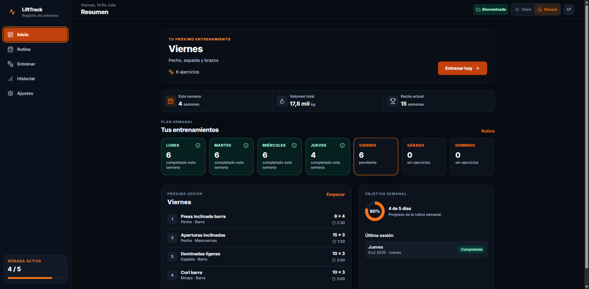
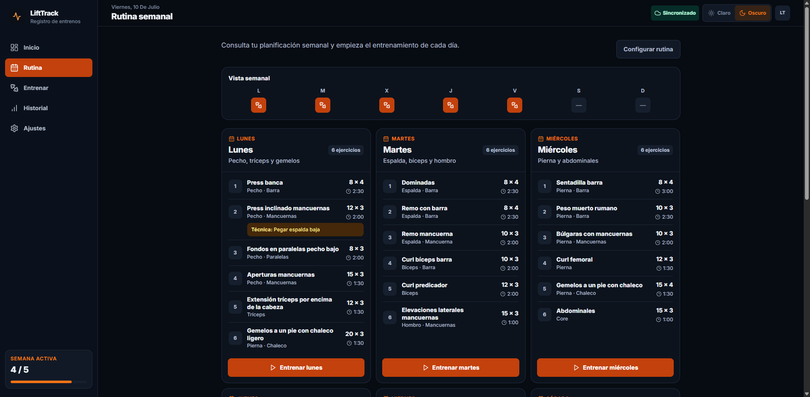
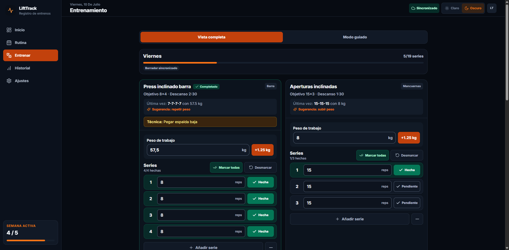
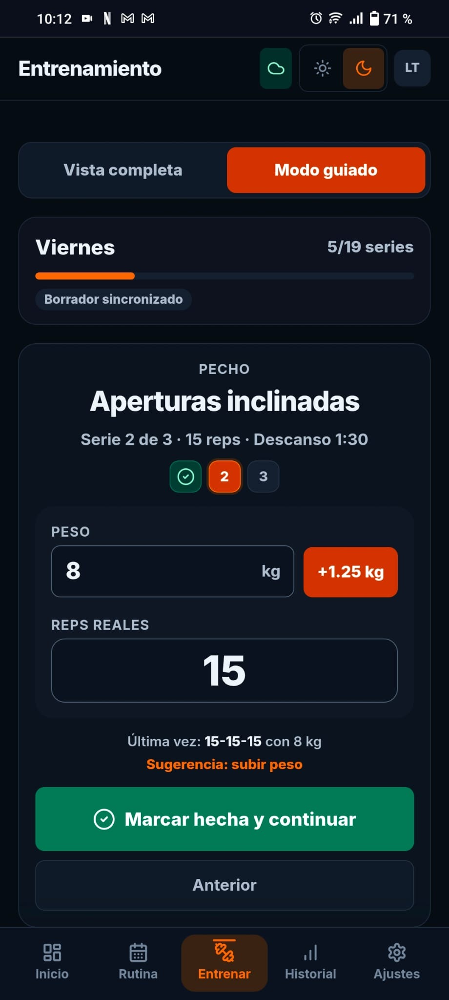
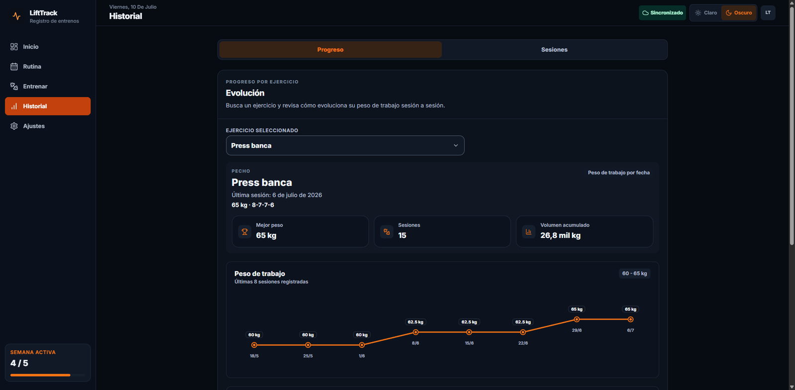
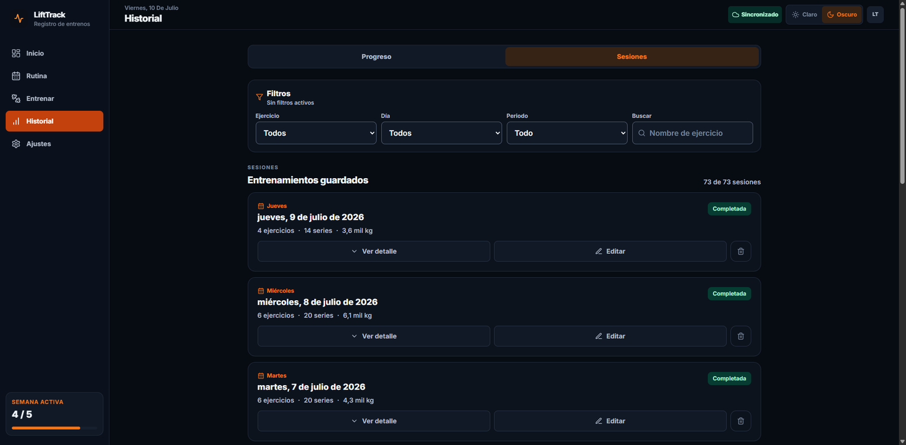
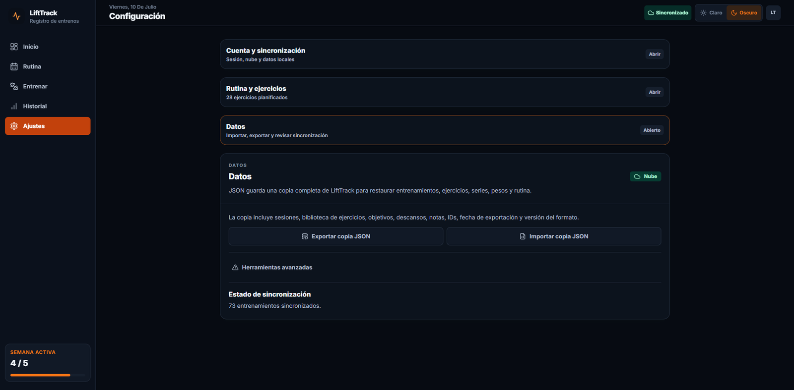

# LiftTrack

  <strong>Registro y seguimiento de entrenamientos de fuerza, con sincronización entre dispositivos.</strong>

  <a href="https://lifttrack-alpha.vercel.app/">Demo</a>
  ·
  <a href="https://github.com/JavierDominguezSabido/lifttrack">Repositorio</a>

  
  
  
  
  
  

  

## Descripción

**LiftTrack** es una aplicación web progresiva para registrar entrenamientos de fuerza, gestionar una rutina semanal y consultar la evolución de cada ejercicio.

El proyecto está diseñado para funcionar tanto en móvil como en escritorio. Los entrenamientos, cambios y borrados se sincronizan mediante Supabase, mientras que los entrenamientos en curso utilizan un sistema de borrado automático local y remoto para poder continuar desde otro dispositivo sin convertir el borrador en una sesión definitiva.

La aplicación se encuentra desplegada en Vercel y se utiliza como proyecto real de seguimiento de entrenamiento.

## Funcionalidades

### Entrenamiento

- Rutina semanal editable.
- Biblioteca y gestión de ejercicios.
- Registro de peso de trabajo, series y repeticiones.
- Vista completa con todos los ejercicios del día.
- Modo guiado para avanzar serie por serie.
- Indicador visual de series completadas, actual y pendientes.
- Recuperación de la posición y del estado del entrenamiento.
- Sugerencias basadas en el último registro.
- Añadir o eliminar series durante la sesión.

### Historial y progreso

- Historial de sesiones guardadas.
- Edición y eliminación de entrenamientos.
- Filtros por ejercicio, día, periodo y búsqueda.
- Progreso por ejercicio.
- Gráfica de peso de trabajo por fecha.
- Mejor peso, número de sesiones y volumen acumulado.
- Registros recientes con pesos, repeticiones y volumen.

### Sincronización y seguridad de datos

- Registro e inicio de sesión con Supabase Auth.
- Sincronización de sesiones entre dispositivos.
- Row Level Security para aislar los datos de cada usuario.
- Borradores locales inmediatos para evitar pérdidas.
- Borradores sincronizados en Supabase.
- Resolución sencilla de borradores por fecha de actualización.
- Funcionamiento local cuando no hay conexión.
- Importación y exportación de copias completas en JSON.

### Experiencia de usuario

- Diseño responsive para móvil, tablet y escritorio.
- PWA instalable.
- Temas claro y oscuro.
- Navegación adaptada a cada tamaño de pantalla.
- Estados de sincronización, errores y confirmaciones.
- Interfaz táctil para utilizar durante el entrenamiento.

## Capturas

### Rutina semanal

  

### Registro de entrenamiento

  

### Modo guiado en móvil

  

### Evolución de un ejercicio

  

### Historial de sesiones

  

### Sincronización y copias de seguridad

  

## Tecnologías

| Área | Tecnología |
|---|---|
| Interfaz | React, TypeScript |
| Herramientas de desarrollo | Vite |
| Estilos | Tailwind CSS |
| Autenticación | Supabase Auth |
| Base de datos | Supabase PostgreSQL |
| Seguridad | Row Level Security |
| Despliegue | Vercel |
| Aplicación instalable | PWA |
| Persistencia auxiliar | `localStorage` / almacenamiento local |

## Arquitectura

LiftTrack utiliza React y TypeScript en el frontend, Supabase para autenticación y persistencia de datos, y Vercel para el despliegue.

La aplicación mantiene sincronizadas la vista completa y el modo guiado, conserva borradores de entrenamiento en curso y separa los borradores de las sesiones definitivas para que no afecten al historial ni a las estadísticas hasta que el entrenamiento se guarda.

## Estado del proyecto

LiftTrack es una aplicación funcional, desplegada y utilizada en entrenamientos reales. Las funcionalidades principales están implementadas y el proyecto continúa evolucionando a partir del uso práctico.

## Demo

La aplicación está disponible en:

**https://lifttrack-alpha.vercel.app/**

## Autor

Desarrollado por **Javier Domínguez Sabido**.

- GitHub: https://github.com/JavierDominguezSabido
- LinkedIn: https://www.linkedin.com/in/javierdominguezsabido/
