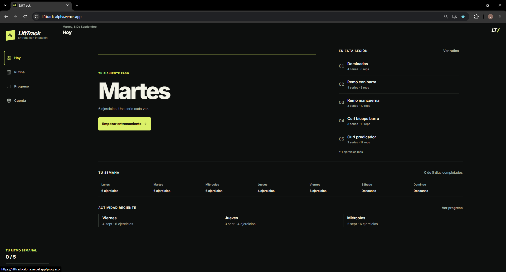
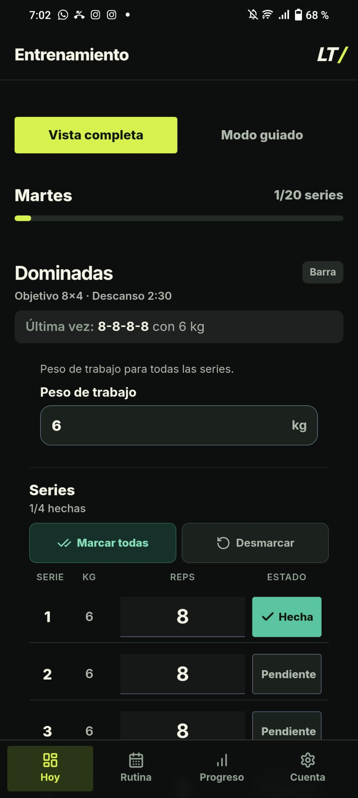
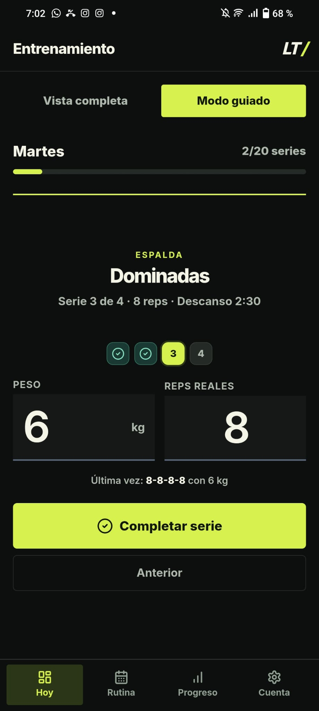
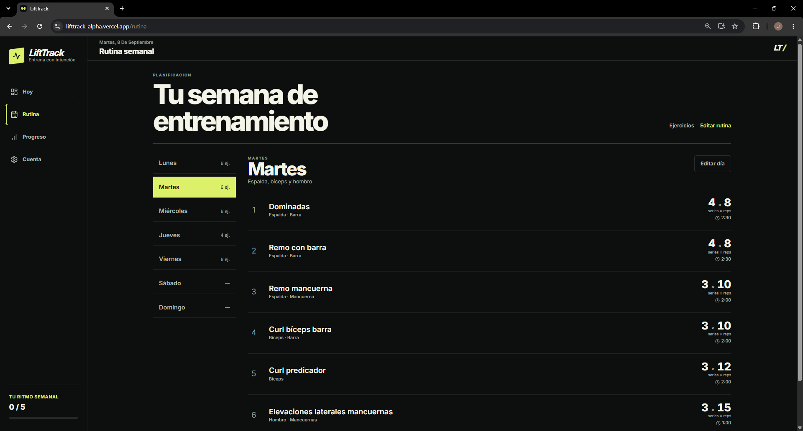
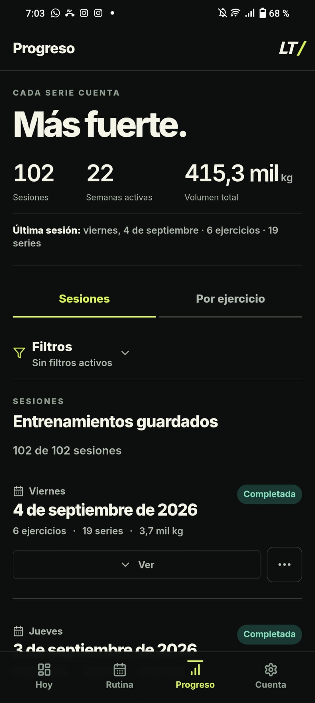
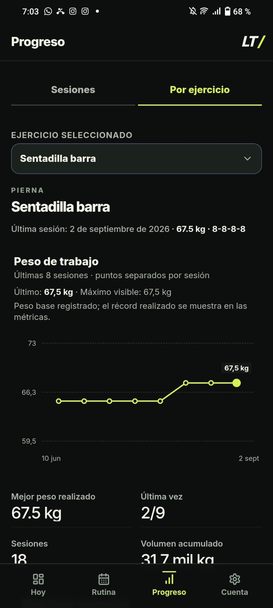
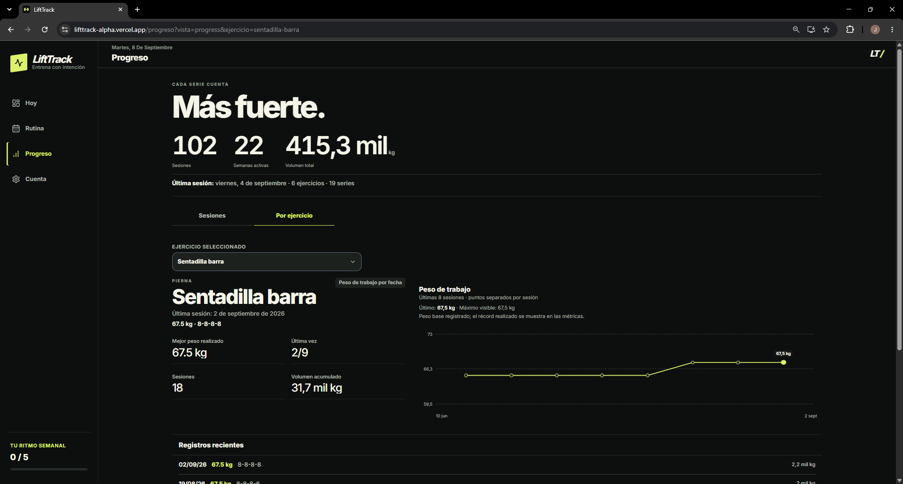

# LiftTrack

Registro de entrenamiento de fuerza con continuidad entre sesiones y dispositivos. LiftTrack reúne planificación semanal, seguimiento por series y evolución histórica, con guardado local inmediato y sincronización que conserva los cambios pendientes cuando falla la conexión.

**[Abrir LiftTrack](https://lifttrack-alpha.vercel.app/)** · React + TypeScript · Supabase / PostgreSQL · PWA instalable



## Del entrenamiento al historial

LiftTrack está pensado para registrar lo que realmente ocurre durante una sesión: pesos distintos entre series, repeticiones que cambian, ejercicios que se incorporan a la rutina y entrenamientos que se interrumpen y continúan después. La planificación sirve de punto de partida; el registro conserva el trabajo realizado.

La navegación se organiza en **Hoy, Rutina, Progreso y Cuenta**. Hoy ofrece la siguiente acción según el estado disponible: preparar una rutina, empezar o continuar un entrenamiento y revisar la actividad. Rutina concentra la planificación y la biblioteca. Progreso reúne sesiones y evolución por ejercicio. Cuenta mantiene autenticación y gestión de datos fuera del flujo de entrenamiento.

La interfaz utiliza un sistema visual oscuro, con navegación lateral en escritorio y barra inferior en móvil. Durante el entrenamiento, la prioridad es mantener controles accesibles, una posición estable al completar series y la posibilidad de recuperar el borrador sin reconstruir la sesión.

### Entrenamiento

La **vista completa** permite consultar y editar los ejercicios del día. El **modo guiado** centra la interacción en una serie cada vez. Ambos trabajan sobre el mismo borrador: cambiar de vista conserva pesos, repeticiones y estado de las series.

El registro admite ajustes por serie y recupera el último rendimiento disponible del ejercicio. Al volver con **Anterior**, solo la serie de destino pasa a pendiente; mantiene sus valores para revisarlos y confirmarlos de nuevo. El autoguardado local funciona independientemente de la red. Los borradores permanecen separados de las sesiones guardadas y no se incorporan por sí solos a las estadísticas.

<table>
  <tr>
    <th>Vista completa</th>
    <th>Modo guiado</th>
  </tr>
  <tr>
    <td align="center"></td>
    <td align="center"></td>
  </tr>
</table>

### Rutinas y ejercicios

La planificación semanal permite dejar días sin entrenamiento y ajustar orden, objetivos, descansos y notas. La biblioteca permite crear, editar y archivar ejercicios. Los campos de la rutina registran cambios mientras se escribe; guardar no depende de perder el foco ni de una confirmación de red.

El historial conserva su propia estructura. Una sesión antigua puede editarse por su identificador aunque la rutina original haya cambiado o ya no exista. Esta separación evita que mantener la planificación actual implique perder la capacidad de corregir registros anteriores.



### Progreso y gestión de datos

El historial permite buscar y filtrar por ejercicio, día y periodo, cargar más sesiones y abrir el detalle cuando hace falta. **Por ejercicio** combina registros recientes, volumen acumulado, mejor peso realizado y evolución del peso de trabajo. La gráfica muestra las últimas ocho sesiones, con una escala explícita y etiquetas reducidas para que una serie plana siga siendo legible.

Las copias JSON y la transferencia CSV permiten conservar y revisar los datos fuera de la aplicación. Las importaciones validan estructura, identificadores, fechas y valores antes de incorporarlos. La edición y eliminación histórica participan en la misma sincronización que el guardado de sesiones nuevas.

<table>
  <tr>
    <th>Sesiones</th>
    <th>Por ejercicio</th>
  </tr>
  <tr>
    <td align="center"></td>
    <td align="center"></td>
  </tr>
</table>

<details>
  <summary>Ver Progreso en escritorio</summary>
  <p></p>
</details>

## Decisiones de arquitectura

### Persistencia local y sincronización

La arquitectura prioriza registrar el cambio antes de intentar enviarlo. Los borradores y las operaciones pendientes se conservan en el almacenamiento del navegador. Con una cuenta, Supabase añade persistencia remota y continuidad entre dispositivos; sin configuración de backend, la aplicación mantiene un modo local.

La sincronización utiliza una **outbox persistente por usuario**, identificadores estables y revisiones esperadas. Los reintentos conservan la identidad de las operaciones y de las sesiones para evitar duplicados. El guardado remoto de una sesión ejecuta cabecera, ejercicios y series en una transacción: un fallo no deja una sesión parcialmente escrita.

Las revisiones permiten detectar conflictos en lugar de resolverlos silenciosamente por la última respuesta recibida. Un conflicto conserva la versión local pendiente y requiere resolución. Las lecturas y la hidratación de borradores descartan respuestas antiguas para que una petición iniciada antes no sobrescriba un cambio posterior. La sincronización ordinaria permanece en segundo plano; la interfaz reserva los avisos para errores o situaciones que requieren intervención.

### Historial paginado y agregados exactos

El historial remoto se consulta mediante **RPC versionadas y paginación por cursor**. Los filtros y los conteos se resuelven antes del límite de página; la interfaz no descarga todas las sesiones para conocer el total filtrado. El filtro por ejercicio y la búsqueda son independientes: una sesión puede satisfacer cada condición con un ejercicio distinto.

Los agregados globales y por ejercicio se calculan en PostgreSQL sobre el conjunto correspondiente. Esto permite obtener un récord antiguo aunque no aparezca entre los registros recientes. La edición histórica carga una sesión completa por ID, y el inicio del entrenamiento utiliza una lectura específica de último rendimiento.

`HistoryReader` comparte caché y peticiones dentro de cada cuenta. `HistoryPager` conserva el cursor, el buffer remoto y los identificadores emitidos. `useHistoryRead` vincula los resultados a cuenta, filtro y generación, evitando publicar respuestas de una pantalla o estado anterior. Foco y reconexión no fuerzan una recarga completa en cada navegación.

### Reconciliación con la outbox

La paginación no elimina la respuesta inmediata del estado local. Cada lectura excluye en servidor los IDs afectados por operaciones pendientes y el cliente incorpora después sus últimas versiones locales:

```text
estado efectivo = confirmado remoto sin IDs pendientes + versiones locales pendientes
```

Los borrados no aportan una versión local; las altas también se excluyen del remoto mientras no están confirmadas, evitando contarlas dos veces si la escritura llegó pero se perdió su respuesta. La paginación mezcla los dos flujos ordenados sin convertir las inserciones locales en cursores del servidor.

Esta decisión también protege las métricas. Al borrar o reducir un récord, el backend calcula el siguiente candidato sobre todo el historial restante. No se intenta reconstruir ese máximo desde una página reciente. Las confirmaciones y los cambios de pendientes invalidan la generación de lectura para que servidor y cliente converjan sobre el mismo conjunto.

### Modelo de datos y límites de acceso

Supabase Auth gestiona las cuentas. PostgreSQL almacena ejercicios, rutinas, sesiones, logs de ejercicios y series, además del estado necesario para borradores y sincronización. Las políticas RLS y las comprobaciones de propiedad delimitan el acceso por usuario. Las lecturas utilizan `SECURITY INVOKER` y comprueban `auth.uid()`; el navegador no necesita una clave `service_role`.

Las [migraciones versionadas](docs/migrations/README.md) conservan las funciones anteriores cuando evoluciona un contrato. La documentación de [lecturas y outbox](docs/read-outbox-contract.md) recoge las reglas de caché, exclusión, orden y convergencia.

## Qué representan las métricas

El volumen y el récord comparten el peso efectivo de la serie, pero responden a preguntas distintas:

- **Volumen:** suma de repeticiones × peso efectivo de las series completadas. Un override sustituye al peso de la serie, incluido un override de cero. Los calentamientos completados participan y una sesión parcial puede aportar volumen. El agregado almacenado en la cabecera no es la fuente de verdad.
- **Mejor peso realizado:** máximo peso efectivo de una serie completada que no sea calentamiento. No se obtiene del peso base planificado.
- **Peso de trabajo:** base registrada para seguir la evolución entre sesiones. Se presenta separado del récord realizado; la gráfica espacia los puntos por sesión, no por tiempo transcurrido.

Las equivalencias se resuelven en cliente. Progreso toma el primer log equivalente de cada sesión y la cuenta una sola vez; el resumen global suma todos los logs. Esta diferencia de alcance se mantiene explícita cuando una sesión contiene varios logs equivalentes.

La fecha efectiva es `completedAt ?? startedAt`. Las semanas empiezan en lunes y se interpretan en la zona local. El último rendimiento usado para comenzar un entrenamiento conserva una regla propia: sesiones finalizadas y series completadas no de calentamiento. Las [definiciones completas](docs/volume-read-contract.md) documentan estas distinciones y el tratamiento de semillas históricas.

## PWA y funcionamiento offline

LiftTrack incluye manifest, iconos y service worker generado por `vite-plugin-pwa`. Tras una primera visita, las rutas principales y los assets de la aplicación quedan disponibles sin conexión. El worker mantiene el precache de la interfaz y limpia versiones obsoletas; no cachea indiscriminadamente respuestas de Supabase.

Los datos de trabajo y la outbox tienen una persistencia separada de esa caché. Las operaciones pendientes se procesan cuando vuelve la conectividad, salvo conflictos que necesiten resolución. Una métrica remota solo puede recalcularse offline si existe una base local compatible con los pendientes actuales. Si falta, queda pendiente de actualización: la aplicación no inventa información que nunca descargó. Borrar el almacenamiento del navegador puede eliminar cambios aún no sincronizados.

## Stack

| Área | Implementación |
| --- | --- |
| Interfaz | React 18, TypeScript 5.6, React Router 7 |
| Estilos e iconos | Tailwind CSS 3, Lucide React |
| Build y PWA | Vite 6, vite-plugin-pwa / Workbox |
| Autenticación y datos | Supabase JS 2, Supabase Auth, PostgreSQL |
| Pruebas | Vitest 3, Testing Library, jsdom, PGlite |
| Análisis estático | TypeScript, ESLint 9 |

El [lockfile](package-lock.json) fija las versiones instaladas. La aplicación pública está enlazada en un dominio de Vercel; el repositorio contiene el cliente y sus contratos SQL, sin un servidor Node propio.

## Organización del repositorio

```text
src/
├── components/   # Layout, controles, diálogos y registro de ejercicios
├── context/      # Cuenta activa y coordinación del estado de entrenamiento
├── data/         # Datos iniciales
├── pages/        # Rutas y composición de pantallas
├── services/     # Repositorios, RPC, outbox, caché e importación/exportación
├── types/        # Modelos de dominio y contratos de base de datos
└── utils/        # Métricas, fechas, equivalencias y reglas de entrenamiento

docs/
├── migrations/  # Evolución de contratos SQL
├── screenshots/ # Capturas de la aplicación
└── *.md         # Contratos técnicos y cierre de validación
```

Los tests conviven con el código que verifican. Los helpers de presentación histórica y el acceso a borradores compartidos están separados de las pantallas; las reglas de sincronización se mantienen en servicios.

## Calidad

La suite actual contiene **166 tests en 29 archivos**, verificados con `npm test`. Cubre edición de rutinas y ejercicios, entrenamiento y borradores, importación/exportación, edición histórica, conflictos, aislamiento entre cuentas, caché y recuperación offline. Los contratos SQL se ejecutan en PostgreSQL aislado mediante PGlite; las pruebas de frontend simulan red y respuestas tardías.

La paginación se comprueba con 1.005 sesiones, incluidos orden, conteos y ausencia de duplicados. Es una prueba de comportamiento, no una cifra de capacidad máxima. Los casos de métricas incluyen overrides, calentamientos, sesiones parciales y eliminación de récords fuera de los registros recientes.

El [cierre técnico](docs/technical-closeout.md) registra TypeScript, build PWA y lint sin warnings, además de revisión de nueve vistas a 1440, 390 y 320×568. También incluye foco y teclado en diálogos, controles guiados y navegación offline. La validación local no sustituye una prueba del backend desplegado ni de instalación en cada plataforma móvil.

## Desarrollo local

Node.js 22 o superior y npm.

```sh
npm ci
npm run dev
```

Supabase es opcional para el modo local. Para activar el backend propio, crear `.env.local` a partir de [.env.example](.env.example):

```dotenv
VITE_SUPABASE_URL=https://<project-ref>.supabase.co
VITE_SUPABASE_ANON_KEY=<public-anon-key>
```

El proyecto Supabase debe disponer del esquema, políticas y funciones requeridos por el cliente. Consultar [docs/migrations/](docs/migrations/README.md) antes de preparar una instalación: parte del esquema base ya incorpora funciones y las migraciones aditivas existentes no deben repetirse. Las variables `VITE_*` se incorporan al cliente; no deben contener claves privilegiadas.

```sh
npm test
npm run lint
npm run build
npm run preview
```

`build` ejecuta TypeScript y genera la PWA. `preview` sirve el resultado para comprobar el service worker; el servidor de desarrollo no sustituye esa validación.

## Estado

LiftTrack se utiliza para seguimiento de entrenamientos y ha evolucionado a partir de ese uso: recuperación de sesiones, edición histórica, sincronización resistente a reintentos y definiciones de métricas compartidas entre cliente y servidor. Los flujos principales están implementados y el cierre técnico está documentado.

Los límites pendientes son concretos: validación de instalación real en iOS/Android y actualización entre despliegues de producción. La disponibilidad offline de agregados sigue dependiendo de contar con una base exacta en el dispositivo.

Desarrollado por [Javier Domínguez Sabido](https://github.com/JavierDominguezSabido).
